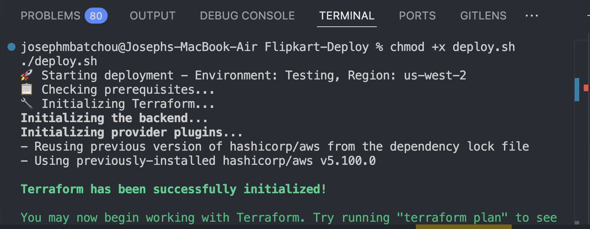
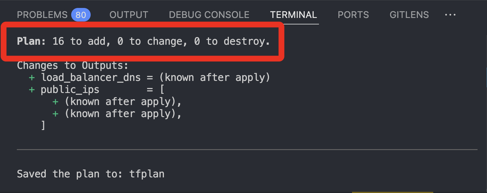
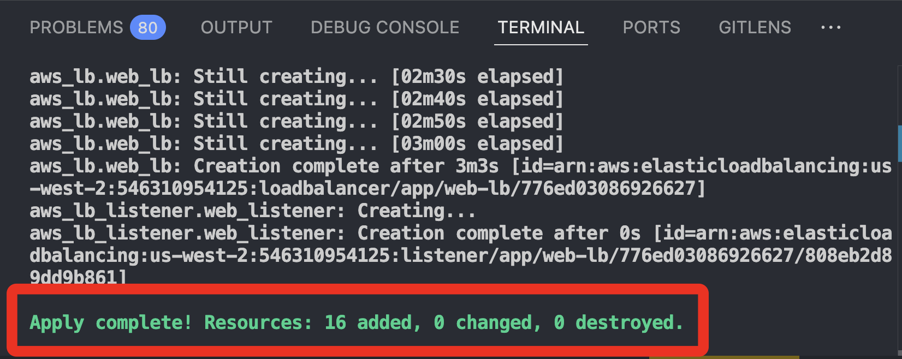
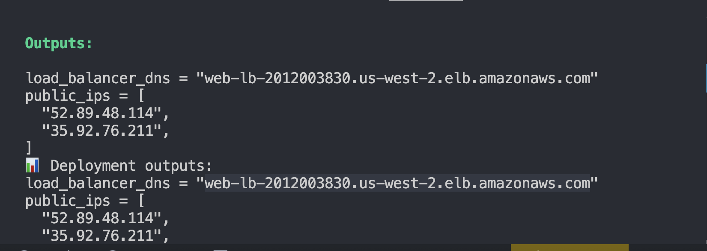
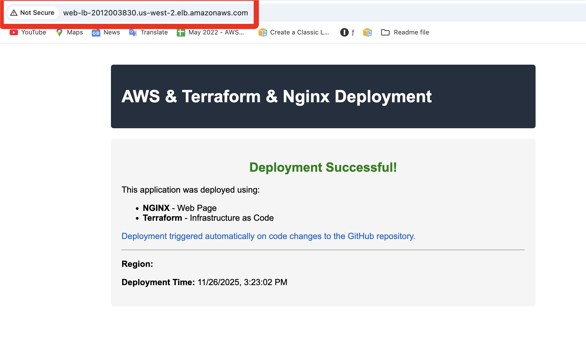
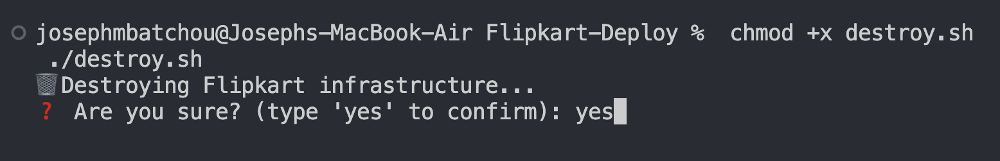
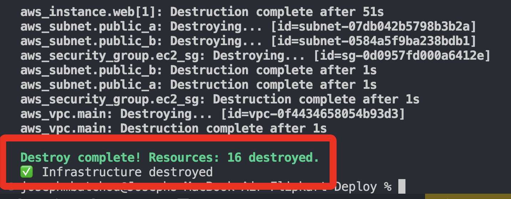

# 🚀 Terraform AWS Deployment

This project demonstrates how to **provision, deploy and destroy infrastructure on AWS using Terraform**.  A **deployment script (`deploy.sh`)** and a **destroy script (`destroy.sh`)** are use for the automation process. It’s a hands-on DevOps project showing Infrastructure as Code (IaC) and automation.

---

## 📂 Project Structure

```
├── main.tf      # Terraform configuration for AWS resources 
├── providers.tf # AWS provider configuration
├── variables.tf  # Define all input and changable arguments
├── terraform.tfvars  # Value of all differents variables
├── outputs.tf      # List of all output that can be use 
├── user-data.sh     # Set of commands of Nginx and html installation
├── deploy.sh    # Deployment script to automate execution  
├── destroy.sh    # Destroy script to automate destruction
```

---

## ⚡ Features

* 🌍 Infrastructure provisioning with **Terraform**
* ☁️ Automated deployment on **AWS**
* 📜 Simple shell script to run & apply Terraform code
* 🛠️ Demonstrates Infrastructure as Code (IaC) best practices

---

## 🛠️ Prerequisites

Make sure you have:

* ✅ [Terraform](https://developer.hashicorp.com/terraform/downloads) installed
* ✅ AWS CLI configured (`aws configure`) with proper credentials
* ✅ Bash shell (Linux/Mac/WSL)

---

## 🚀 How to Run

1. **Clone this repository**

   ```bash
   git clone https://github.com/Joebaho/Flipkart-Deploy.git
   cd Flipkart-Deploy
   ```

2. **Run Deployment Script**

   ```bash
   chmod +x deploy.sh
   ./deploy.sh
   ```

The process will display following images:

Terraform init: 


Terraform fmt and validate:


Terraform plan:


Terraform apply:


Terraform output:


After copy the ELb dns in the output section you can go paste that in a new window on the browser and the web page will display.



3. **Destroy Infrastructure (when done)**

  ```bash
   chmod +x destroy.sh
   ./destroy.sh
  ```

After typing or pasting the command you will get images





---

## 📌 Learning Outcomes

* Understand **Terraform basics** (providers, resources, state management)
* Automate deployments with **Shell scripting**
* Hands-on AWS infrastructure provisioning

---

## 🔗 Resources

* [Terraform AWS Provider Docs](https://registry.terraform.io/providers/hashicorp/aws/latest/docs)
* [Terraform CLI Docs](https://developer.hashicorp.com/terraform/cli)

---